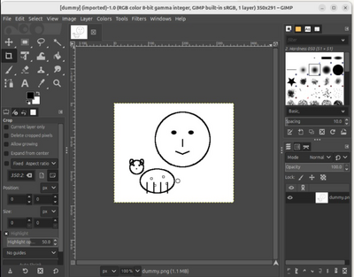

# GIMP MCP

[](https://www.gnu.org/licenses/gpl-3.0)
[](https://claude.ai/desktop)
[](https://gimp.org)
[](https://modelcontextprotocol.io)

## Overview

This project enables non-technical users to edit images with GIMP through simple conversational commands, bridging the gap between GIMP's powerful capabilities and natural language interaction. It also allows professionals to execute complex multi-step workflows faster than traditional point-and-click methods.

Users can describe what they want to achieve - from basic photo adjustments to sophisticated artistic modifications. For example, "brighten the background and add a vintage filter" or "remove the red-eye and sharpen the subject" - and the system translates these requests into precise GIMP operations.

The project is fully functional and exposes all GIMP features via MCP (Model Context Protocol). **New in this version**: MCP-compliant image export that allows AI assistants like Claude to directly view and analyze your GIMP images!

## Key Features

✨ **MCP-Compliant Image Export**: Direct image viewing for AI assistants  
🎨 **Full GIMP 3.0 API Access**: Execute any GIMP operation via PyGObject  
🔧 **Multi-Format Export**: PNG, JPEG, BMP, TIFF with quality control  
📊 **Image Metadata**: Get image info without transferring data  
🛡️ **Robust Error Handling**: Multiple fallback methods for reliability  
🔌 **Universal MCP Support**: Works with Claude Desktop, Gemini CLI, PydanticAI, and more


## Prerequisites
* **GIMP 3.0 and above:** This project is developed and tested with GIMP 3.0. Earlier versions are not supported.
* **MCP-compatible AI client:** Claude Desktop, Gemini CLI, PydanticAI, or other MCP clients.
* **Python 3.8+:** Required for the MCP server.
* **uv:** A modern Python package installer and resolver.

## Quick Start

### 1. Install Dependencies
```bash
# Clone the repository
git clone https://github.com/maorcc/gimp-mcp.git
cd gimp-mcp

# Install Python dependencies
uv sync
```

### 2. Install the GIMP Plugin

Copy the `gimp-mcp-plugin.py` to your GIMP `plug-ins` directory and make it executable.

**Quick Install (Linux/macOS):**
```bash
# For standard GIMP installation
mkdir -p ~/.config/GIMP/3.0/plug-ins/gimp-mcp-plugin
cp gimp-mcp-plugin.py ~/.config/GIMP/3.0/plug-ins/gimp-mcp-plugin/
chmod +x ~/.config/GIMP/3.0/plug-ins/gimp-mcp-plugin/gimp-mcp-plugin.py

# For Snap-installed GIMP
mkdir -p ~/snap/gimp/current/.config/GIMP/3.0/plug-ins/gimp-mcp-plugin
cp gimp-mcp-plugin.py ~/snap/gimp/current/.config/GIMP/3.0/plug-ins/gimp-mcp-plugin/
chmod +x ~/snap/gimp/current/.config/GIMP/3.0/plug-ins/gimp-mcp-plugin/gimp-mcp-plugin.py
```

**Manual Installation:**

For detailed instructions on locating your GIMP plugins folder across different operating systems, please refer to this guide:

[**GIMP Plugin Installation Guide (Wikibooks)**](https://en.wikibooks.org/wiki/GIMP/Installing_Plugins)

Make sure the plugin file has "execute" permission.

**Restart GIMP** after installation.

### 3. Start the MCP Server in GIMP
1. Open any image in GIMP
2. Navigate to **Tools > Start MCP Server** 
3. The server will start on `localhost:9877`

### 4. Configure Your MCP Client
#### Claude Desktop
Add these lines to your Claude Desktop configuration file:  
**Location**: `~/.config/Claude/claude_desktop_config.json` (Linux/macOS) or `%APPDATA%\Claude\claude_desktop_config.json` (Windows)

```json
{
  "mcpServers": {
    "gimp": {
      "command": "uv",
      "args": [
        "run",
        "--directory",
        "/full/path/to/gimp-mcp",
        "gimp_mcp_server.py"
      ]
    }
  }
}
```

#### Gemini CLI
Configure your Gemini CLI MCP server in `~/.config/gemini/.gemini_config.json`:
```json
{
  "mcpServers": {
    "gimp": {
      "command": "uv",
      "args": [
        "run",
        "--directory",
        "/full/path/to/gimp-mcp",
        "gimp_mcp_server.py"
      ]
    }
  }
}
```

#### PydanticAI
For PydanticAI agents, use the MCPServerStdio class:
```python
from pydantic_ai import Agent
from pydantic_ai.mcp import MCPServerStdio

server = MCPServerStdio(
    'uv',
    args=[
        'run',
        '--directory',
        '/full/path/to/gimp-mcp',
        'gimp_mcp_server.py'
    ]
)

agent = Agent('openai:gpt-4o', mcp_servers=[server])
```

#### Other MCP Clients
For other MCP clients that support stdio transport, use the command:
```bash
uv run --directory /full/path/to/gimp-mcp gimp_mcp_server.py
```

## Usage Examples

### Basic Usage
1. **Start GIMP** and open any image
2. **Start MCP Server**: Tools > Start MCP Server  
3. **Launch your MCP client** (Claude Desktop, etc.)
4. **Start creating**: "Draw a face and a sheep with GIMP"

### Advanced Features

#### Image Analysis
```
"Can you show me the current image in GIMP and tell me what you see?"
```
*Uses `get_image_bitmap()` to retrieve and analyze the current canvas*

#### Complex Workflows
```
"Create a new 800x600 image, draw a blue circle in the center, add a red border, then show me the result"
```
*Combines multiple GIMP operations with image export for verification*

## Available MCP Tools

The GIMP MCP server provides several tools that AI assistants can use:

### 🖼️ Image Export Tools
- **`get_image_bitmap()`**: Get current image as MCP-compliant Image object (PNG format)

### 🔧 API Access Tool  
- **`call_api(api_path, args, kwargs)`**: Execute any GIMP 3.0 PyGObject command

### 🎨 Common Operations Available
- Create new images and layers
- Draw shapes, lines, and curves  
- Apply filters and effects
- Adjust colors and brightness
- Add text and selections
- Copy/paste between images
- Export in various formats

For detailed API documentation, see [GIMP_MCP_PROTOCOL.md](GIMP_MCP_PROTOCOL.md).

## Technical Architecture

### MCP Compliance
- **Image Content**: Returns proper `ImageContent` objects with base64 data and MIME types
- **Error Handling**: Uses MCP-standard exception propagation  
- **Tool Metadata**: Comprehensive tool descriptions and parameter schemas
- **Protocol Version**: Compatible with MCP specification 2025-06-18

### GIMP 3.0 Integration
- **PyGObject API**: Direct access to GIMP's Python bindings
- **Persistent Context**: Command execution maintains state between calls
- **Robust Export**: Multiple fallback methods for reliable image export
- **Real-time Updates**: Immediate display refresh with `Gimp.displays_flush()`

## Troubleshooting

### Common Issues

#### "Could not connect to GIMP"
- Ensure GIMP is running with an open image
- Verify the MCP Server is started (Tools > Start MCP Server)
- Check that port 9877 is not blocked by firewall

#### Export Errors
- The plugin includes multiple fallback export methods
- Supports various GIMP 3.0 API versions
- Automatically handles missing export procedures

#### Plugin Not Visible
- Verify plugin is in correct directory with execute permissions
- Restart GIMP after installation
- Check GIMP's error console for plugin loading issues

### Debug Mode
Add debug logging to see detailed MCP communication:
```bash
GIMP_MCP_DEBUG=1 uv run --directory /path/to/gimp-mcp gimp_mcp_server.py
```

## Example Output



*Example output from the prompt "draw me a face and a sheep" using GIMP MCP*

## Future Enhancements

We welcome contributions! Here are some areas for improvement:

### Planned Features
- **📚 Recipe Collection**: Common GIMP workflows as reusable MCP tools
- **↩️ Undo System**: History management and rollback capabilities  
- **🔍 Visual Feedback**: Enhanced progress indicators and operation previews
- **🚀 Dynamic Discovery**: Auto-generate MCP tools from GIMP's procedure database
- **📝 Enhanced Errors**: Context-aware error messages with suggested fixes
- **🛡️ Resource Management**: Better cleanup and error recovery in the plugin

### Architecture Improvements
- **🔒 Security**: Sandboxed execution environment for user commands
- **⚡ Performance**: Optimized image transfer for large files
- **🌐 Remote Access**: Support for network-accessible GIMP instances
- **📊 Analytics**: Usage metrics and performance monitoring

## Contributing

Contributions are welcome! Whether it's bug fixes, new features, or documentation improvements, feel free to submit a Pull Request or open an issue.
